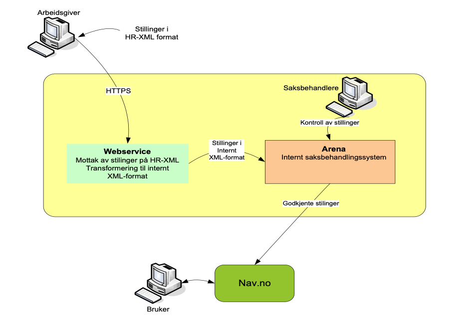

# Xmlstilling - Brukerveiledning
Stillinger i XML-format til nav.no. 

Denne dokumentasjonen er overført direkte fra det tidligere [word-dokumentet](https://github.com/navikt/pam-xmlstilling-ws/doc/Brukerveiledning_for_XMLstilling_v.1.2_-_2016.doc). Noe informasjon kan derfor være
uttdatert.

## Innledning
NAV har som en service til eksterne virksomheter etablert en tjeneste, webservice, 
som gjør det mulig å sende stillinger på XML-format over Internett for publisering i 
nav.no. Tjenesten blir omtalt med navnet **XMLstilling**. Tjenesten benytter det 
internasjonale formatet HR-XML for stillinger.

Denne brukerveiledningen beskriver fremgangsmåten for hvordan tjenesten skal brukes 
med de nødvendige opplysningene som f. eks WSDL, XSD og en oversikt over hvilke 
felter fra HR-XML som kan brukes. Det stilles også en noen vilkår ved bruk av 
Xmlstilling. Vilkårene er omtalt i kapittel 7.

Det er viktig å understreke at tjenesten bare er tilgjengelig etter avtale med NAV. 
Eksempel på avtale dokument finnes i kapittel 8. 

### Hensikt med tjenesten

NAV ønsker med denne tjenesten å oppnå følgende:
-	Gjøre flere ledige stillinger tilgjengelig for allmennheten gjennom publisering 
på Internett.
-	Bidra til at arbeidsgivere sikres enda bedre kvalifisert arbeidskraft ved at 
annonsene blir tilgjengelig på nav.no.
-	Betydelig reduksjon av arbeidet i NAV med innregistrering av ledige stillinger. 
-	Sørge for at ledige stillinger kommer raskere på internett.

### Definisjoner, akronymer og forkortelser

Begrep        | Definisjon
------        | ----------
HR-XML        | Standardisert xml-format.
Arena         | Saksbehandlingssystem i NAV
Xmlstilling	  | Komponent for håndtering av StillingsInformasjon på Xml-format. 
STI	Komponent | for søk/match av StillingsInformasjon. 

## Overordnet beskrivelse av løsningen 
Først litt om hvordan tjenesten er bygd opp.



Kort forklaring på hvordan tjenesten fungerer, se figuren: 

1.	Arbeidsgiver sender stillingsinformasjon på HR-XML format over HTTPS
1.	Det blir foretatt en autentisering av ident og passord som ligger vedlagt.
1.	Stillingene blir lagret midlertidig i webtjenesten og det blir sendt en 
kvittering 
og status tilbake til arbeidsgiver om overføringen.
1.	I webtjenesten blir stillingsinformasjonen transformert fra formatet HR-XML 
til NAV sitt interne xml-format. 
1.	De transformerte stillingene sendes over til NAV’s interne saksbehandlingssystem, 
Arena, hvor stillingene lagres for kontroll.
1.	Saksbehandler i NAV kontrollerer stillingene, legger til nødvendig klassifisering 
av stillingene (etter yrke og geografi) og overfører til nav.no
1.	Stillingene blir søkbare og tilgjengelig på nav.no i løpet av kort tid, i løpet 
av 1 time til ca. 1 virkedag.

## Hvordan få tilgang

### Administrativt
Tilgang skjer gjennom en gjensidig avtale mellom NAV og bruker av
tjenesten. Etter inngåelse av avtale får bruker tilsendt brukernavn og passord sammen 
med brukerveiledningen.

I vedlegg A finnes det eksempel på avtale.

URL, brukernavn og passord vil bli utlevert når en har fått avklart hvordan samarbeidet 
med NAV skal praktiseres. 

### Teknisk
Xmlstilling er en webtjeneste som er beregnet på å bli kalt opp av en applikasjon som 
sender over stillingsinformajon i HR-xml format. Brukerne må selv utvikle en 
applikasjon som gjør dette tilpasset deres egen arkitektur. Applikasjonen vil f.eks. 
kunne bestå av to hovedmoduler, en for å hente ut data fra brukernes registre og en 
for å kalle opp Xmlstilling. 

Brukere skriver sin egen prosedyre/modul for å kalle opp Xmlstilling. Da må en 
forholde seg til de spesifikasjonene av WSDL og XSD som er beskrevet i kap. 4. 
Stillinger sendes over enkeltvis.

For å teste tekniske forhold kan f.eks. verktøyet SOAPUI brukes (se kap. 4).


## Tjenestegrensesnitt
XML-formatet som benyttes inn til tjenesten er HR-XML som er et internasjonalt 
format for personaldata og stillinger. Det er versjon 2.5 som brukes.  I denne 
tjenesten benytter vi den delen av HR-XML som omfatter stillinger, definert i 
PositionOpening.xsd. 

Hvilke felter som kan brukes fra HR-XML er beskrevet i kap. 5.  Dersom det ønskes 
andre felter fra HR-XML må dette tas opp med nav slik at en i fellesskap kan 
tarbeide en bedre tilpasset oversikt enn den som fins. 

Soap-meldingen må inneholde alle nødvendige felter. Dette inkluderer `<SOAP-ENV:Envelope>`.
Se på soap eksemplet i kap. 5.2

Vi beklager at vår wsdl foreløpig ikke ligger tilgjengelig for validering, derfor må 
beskrivelsene I dette dokumentet brukes som utgangspunkt for å lage egne xml-dokumenter.

Hvis man ikke har, men ønsker verktøystøtte for utvikling og testing, kan vi f.eks. 
anbefale verktøyet SOAPUI som kan lastes ned fra internettet.


### Beskrivelse av WSDL
```xml
<?xml version="1.0" encoding="ISO-8859-1"?>

<definitions xmlns = "http://schemas.xmlsoap.org/wsdl/" 
        xmlns:soap = "http://schemas.xmlsoap.org/wsdl/soap/" 
        xmlns:http = "http://schemas.xmlsoap.org/wsdl/http/" 
          xmlns:xs = "http://www.w3.org/2001/XMLSchema" 
     xmlns:soapenc = "http://schemas.xmlsoap.org/soap/encoding/" 
         xmlns:ns1 = "http://www.nav.no/nav_stilling_reg.wsdl" 
         xmlns:ns2 = "http://www.nav.no/nav_stilling_typer.xsd" 
   targetNamespace = "http://www.nav.no/nav_stilling_reg.wsdl">

   <types>
      <xs:schema>
         <xs:import namespace="http://www.nav.no/nav_stilling_typer.xsd" schemaLocation="./xsd/nav_stilling_typer.xsd"/>
      </xs:schema>
   </types>

   <message name="LeggInnStillingerIn">
      <part name="StillingListe" type="ns2:StillingListeType"/>
   </message>

   <message name="LeggInnStillingerOut">
      <part name="Id" type="ns2:SvarType"/>
   </message>

   <portType name="NavEksterneStillingerPortType">
      <operation name="LeggInnStillinger">
         <input message="ns1:LeggInnStillingerIn"/>
         <output message="ns1:LeggInnStillingerOut"/>
      </operation>
   </portType>

   <binding name="NavEksterneStillingerBinding" type="ns1:NavEksterneStillingerPortType">
      <soap:binding style="rpc" transport="http://schemas.xmlsoap.org/soap/http"/>

      <operation name="LeggInnStillinger">
         <input>
            <soap:body use="literal"/>
         </input>
         <output>
            <soap:body use="literal"/>
         </output>
      </operation>
   </binding>

   <service name="NavEksterneStillingerService">
      <port name="NavEksterneStillingerPort" binding="ns1:NavEksterneStillingerBinding">
         <soap:address location="http://www.nav.no/eksternestillinger"/>
      </port>
   </service>
</definitions>
```

### Beskrivelse av xsd
```xml
<?xml version="1.0" encoding="ISO-8859-1"?>

<xs:schema targetNamespace = "http://www.nav.no/nav_stilling_typer.xsd"
                  xmlns:xs = "http://www.w3.org/2001/XMLSchema"
                 xmlns:ns1 = "http://www.nav.no/nav_stilling_typer.xsd"
                 xmlns:ns2 = "http://ns.hr-xml.org/2007-04-15" 
                xmlns:soap = "http://schemas.xmlsoap.org/wsdl/soap/"
        elementFormDefault = "qualified"
      attributeFormDefault = "unqualified"
                   version = "1.0">

  <xs:import namespace="http://ns.hr-xml.org/2007-04-15" schemaLocation="position_opening.xsd"/>

  <xs:complexType name="StillingListeType">
    <xs:sequence>
      <xs:element name="PositionOpening" type="ns2:PositionOpeningType" minOccurs="0" maxOccurs="unbounded"/>
    </xs:sequence>
   </xs:complexType>

   <xs:complexType name="SvarType">
    <xs:sequence>
      <xs:element name="KlientReferanse" type="xs:string"/>
      <xs:element name="EksekveringOK" type="xs:boolean"/>
      <xs:element name="Feilkode" type="xs:string" minOccurs="0"/>
      <xs:element name="Feilmelding" type="xs:string" minOccurs="0"/>
    </xs:sequence>
  </xs:complexType>
</xs:schema>

```

Merk at elementet ”EksekveringOK” er av typen xs:boolean. Verdien som sendes i elementet er imidlertid en
string med verdi ”OK_DUMMY”.

### Oversikt over felter fra HR-XML som kan brukes

Tjenesten baseres på HR-XML. Adressen til denne standarden er

http://ns.hr-xml.org/2_5/HR-XML-2_5/StandAlone/PositionOpening.xsd
 
### Utdrag fra HR-XML 

I denne første versjonen av tjenesten er følgende felter fra HR-XML i bruk.


Ref. til nav.no | Navn på element I HR-XML | Obl. | Forklaring
--------------- | ------------------------ | ---- | ----------
Ingen                | <SOAP-ENV:Envelope xmlns:m="http://www.nav.no/nav_stilling_reg.wsdl" xmlns:m0="http://www.nav.no/nav_stilling_typer.xsd" xmlns:xsi="http://www.w3.org/2001/XMLSchema-instance" xmlns:SOAP-ENC="http://schemas.xmlsoap.org/soap/encoding/" xmlns:m2="http://ns.hr-xml.org/2007-04-15" xmlns:xsd="http://www.w3.org/2001/XMLSchema" xmlns:SOAP-ENV="http://schemas.xmlsoap.org/soap/envelope/"> <SOAP-ENV:Body> | | Dette er det namespace som skal brukes. Web servicen vil feile hvis man bruker noe annet enn xmlns:m0=http://www.nav.no/nav_stilling_typer.xsd.` 
Ingen        | `PositionPostings.PositionPosting.Id.IdValue`                                               | N | Referansenummer  (ident) til avsenders annonse. Brukes internt for sammenligning
1             | `PositionProfile.ProfileName`                                                               | J | Navn på organisasjon (arbeidsgivers navn)
9             | `PositionProfile.ProfileName`                                                               | J | Tittel på stilling/yrkestittel
Ingen         | `PositionProfile.PositionDateInfo.StartAsSoonAsPossible`                                    | N | Hvis dato ikke brukes, men ”snarest” gjelder. Verdi skal være true eller false hvis feltet brukes
17            | `PositionProfile.PositionDateInfo.StartDate`                                                | N | Stilling ledig fra dato
18            | `PositionProfile.PositionDateInfo.ExpectedEndDate`                                          | N | Stilling ledig til dato
20            | `PositionProfile.PositionDateInfo.MaximumStartDate`                                         | N | Søknadsfrist 
21            | `PositionProfile.PositionDateInfo.MaximumEndDate`                                           | N | Siste publiseringsdato. Hvis elementet brukes, må verdien være lik eller mindre enn elementet for søknadsfrist. Elementet brukes også om man ønsker å slette ei annonse. Annonsen sendes da på nytt med dagens dato i elementet.
8             | `PositionProfile.Organization`                                                              | N | Bedriftsomtale
14            | `PositionProfile.PositionDetail.PhysicalLocation.Name`                                      | N | Arbeidssted Max lengde 255
3             | `PositionProfile.PositionDetail.PhysicalLocation.PostalAddress.PostalCode`                  | J | Arbeidsgivers postnr
2             | `PositionProfile.PositionDetail.PhysicalLocation.PostalAddress.DeliveryAddress.AddressLine` | N | Arbeidsgivers gateadresse, etasje, inngang, postboks
12c           | `PositionProfile.PositionDetail.PositionSchedule/@percentage`                               | J | Hvor stor prosentvis stilling. Hvis det er behov for desimal, skal skilletegn være punktum (.)., f.eks. 33.3
22 + 13 + 19  | `PositionProfile.FormattedPositionDescription.Value`                                        | J | Fremst i teksten legges hvis mulig bedriftens organisasjonsnummer, deretter om ønskelig kontaktinformasjon for tilbakemelding fra NAV, så følger stillingsbeskrivelse, krav til kompetanse, utdanning m.m. I tillegg legges alle andre relevante opplysninger som ikke passer andre steder, inn her. Det kan være opplysninger om kontaktperson og kontaktinformasjon, søknadslenke, søknad merkes, stillingsid. Legg inn disse med aktuell ledetekst.
5             | `PositionProfile.HowToApply.ApplicationMethod.InternetWebAddress `                          | N | Adresse til arbeidsgivers nettside. Max lengde 100
11            | `NumberToFill`                                                                              | J | Antall stillinger i annonsen
Ingen         | `DistributionGuidelines@validFrom`                                                          | N | Angir dato i framtid for når publisering skal starte. Hvis ikke utfylt, vil publisering skje umiddelbart etter saksbehandlers godkjenning

### Eksempel på Soap-melding

```xml
<?xml version="1.0" encoding="UTF-8"?>
<SOAP-ENV:Envelope xmlns:m="http://www.nav.no/nav_stilling_reg.wsdl" xmlns:m0="http://www.nav.no/nav_stilling_typer.xsd" xmlns:xsi="http://www.w3.org/2001/XMLSchema-instance" xmlns:SOAP-ENC="http://schemas.xmlsoap.org/soap/encoding/" xmlns:m2="http://ns.hr-xml.org/2007-04-15" xmlns:xsd="http://www.w3.org/2001/XMLSchema" xmlns:SOAP-ENV="http://schemas.xmlsoap.org/soap/envelope/">
	<SOAP-ENV:Body>
		<m:LeggInnStillinger>
			<StillingListe>
				<m0:PositionOpening>
					<PositionPostings>
						<PositionPosting>
							<Id>
								<IdValue>261612530</IdValue>
							</Id>
						</PositionPosting>
					</PositionPostings>
					<PositionSupplier>
						<SupplierId>
							<IdValue>Webcruiter</IdValue>
						</SupplierId>
						<EntityName>SalatMester’n A/S</EntityName>
					</PositionSupplier>
					<PositionProfile>
						<ProfileName>Produksjonsmedarbeider</ProfileName>
						<PositionDateInfo>
							<StartDate>2008-09-01</StartDate>
							<ExpectedEndDate>2009-12-31</ExpectedEndDate>
							<MaximumStartDate>2008-08-31</MaximumStartDate>
							<MaximumEndDate>2008-08-31</MaximumEndDate>
							<StartAsSoonAsPossible>false</StartAsSoonAsPossible>
						</PositionDateInfo>
						<Organization>Salatmestern er en næringsmiddelindustriprodusent som produserer:majones, majonesbaserte salater, dressinger, sildeprodukter og sjøprodukter i lake. Omsetning i 2004 var rundt 130 mill. NOK og vi er rundt 55 ansatte.</Organization>
						<PositionDetail>
							<Company/>
							<PhysicalLocation>
								<Name>Fredrikstad (Østfold)</Name>
								<PostalAddress>
									<PostalCode>1624</PostalCode>
									<DeliveryAddress>
										<AddressLine>Pancoveien 16 Første etage Inngang 7 B</AddressLine>
									</DeliveryAddress>
								</PostalAddress>
							</PhysicalLocation>
							<PositionSchedule percentage="66.7"/>
						</PositionDetail>
						<FormattedPositionDescription>
							<Value><![CDATA[Org. nr: 999888999 Stillingsident: 261612530  Presentasjon av stillingen: Medarbeideren skal jobbe innenfor avdelingen for klargjøring /bearbeiding av råvarer før de går til blanding. Arbeidet vil medføre mange tunge løft og krav om generelt god fysikk/helse.]]></Value>
						</FormattedPositionDescription>
						<HowToApply>
							<ApplicationMethod>
								<InternetWebAddress>www.salatmestern.no</InternetWebAddress>
							</ApplicationMethod>
						</HowToApply>
						<DistributionGuidelines validFrom=”2013-02-28”/>
					</PositionProfile>
					<NumberToFill>3</NumberToFill>
				</m0:PositionOpening>
			</StillingListe>
		</m:LeggInnStillinger>
	</SOAP-ENV:Body>
</SOAP-ENV:Envelope>

```

### Referanse fra xml-eksempel til stillingsannonse i nav.no

`1`SalatMester'n A/S
`2`  Postadresse:  
Pancoveien 16  
Første etage  
Inngang 7B  
31624 GRESSVIK  
`5` Nettside: www.salatmestern.no


`8`Salatmestern er en næringsmiddelindustriprodusent som produserer:majones, majones 
baserte salater, dressinger, sildeprodukter og sjøprodukter i lake. Omsetning i 2004 
var rundt 130 mill. NOK og vi er rundt 55 ansatte.
`9`Produksjonsmedarbeider
`22`Medarbeideren skal jobbe innenfor avdelingen for klargjøring/bearbeiding av 
råvarer før de går til blanding. Arbeidet vil medføre mange tunge løft og krav om 
generelt god fysikk/helse. 

`11`Antall stillinger 3

`12`Type stilling
(66.7%) 

`13`Lønn
Lønn etter avtale 

`14`Arbeidssted
Fredrikstad

`17`Stilling ledig fra 1. september 2008

`18`Stilling ledig til 31. desember 2009

`19`Søknaden merkes Søknad om stillingen som salatmester

`20`Søknadsfrist 31. august 2008

`21`Siste publiseringsdato 31. august 2008

`Legges inn av NAV:`
Kilde Overført fra arbeidsgiver

`NAVs referansenummer for stillingen (Legges inn hos NAV)`
Stillingsnummer: 0205 - 2007 - 06 - 000014 (Oppgis ved kontakt med NAV)

## Endringer og sletting av annonser

NAV tar ikke vare på eksterne identer, så det er ingen automatisk oppdatering når 
samme annonse sendes inn på nytt. At det er samme annonse, identifiseres av 
saksbehandlerne på vårt servicesenter, og de sørger for at annonsen oppdateres 
i vårt system.

Hvis man ønsker å slette an annonse, skal den sendes på nytt, 
og gi verdi med dagens dato i elementet `<PositionProfile.PositionDateInfo.MaximumEndDate>. 
Dette medfører at annonsen ikke vises for brukere av våre systemer.


## Brukergrensesnitt for å kontrollere egne opplysninger.
Når man har sendt over stillinger til NAV, kan man ved å gå inn på en web-side få verifisert om oversendelsen er OK. Man logger seg på med samme brukernavn og passord som det man bruker ved oversendelse.
Ved å klikke på lenke på siden man kommer til, kan man få status for den enkelte stilling.
Adressen til grensesnittet er som følger:
For testmiljø: https://tjenester-q1.nav.no/xmlstilling/StillingBatch
For produksjonsmiljø: https://tjenester.nav.no/xmlstilling/StillingBatch

Avhengig av resultatet av prosesseringen vil følgende koder være aktuelle:
1. Sendingen ble ikke prosessert av web-sevicen. Må sendes på nytt!
1. Webservicen prosseserte OK – XML velformet
1. XML validerer
1. Stilling omformet til intern struktur.
1. Kobling mot saksbehandlingssystem etablert
1. Stilling oversendt saksbehandlingssystem
1. Stilling akseptert av saksbehandlingssystem, ikke verifisert av saksbehandler

Negative verdier av de enkelte koder betyr at prosessen feilet på det punktet.

## Vilkår for tjenesten Xmlstilling

For at annonser skal publiseres i NAVs systemer gjelder følgende krav:

### Annonser _må_ inneha følgende informasjon

Stillingstittel  
Arbeidsgivers navn  
Arbeidsgivers adresse (min postnr)  
Søknadsfrist eller siste publikasjonsdato  
Stillingsomtale\beskrivelse av stillingen  
Antall ledige stillinger  

### Øvrige vilkår

Det er ved ansettelser ulovlig å forskjellsbehandle arbeidssøkere på grunnlag av kjønn, religion, livssyn, hudfarge, nasjonal eller etnisk opprinnelse, politisk syn, medlemskap i arbeidstakerorganisasjon, seksuell orientering, funksjonshemming eller alder. 

Forbudet omfatter også indirekte diskriminering; for eksempel at det stilles krav om meget gode norskkunnskaper, avtjent verneplikt eller alder, uten at slike krav er nødvendige for å utføre stillingens arbeidsoppgaver på en forsvarlig/lovlig måte. 


Eksempler på formuleringer relatert til alder som er indirekte diskriminerende: 


”Vi tilbyr et ungt miljø”

”Vi ser gjerne for oss at du er i alderen 20-30 år”

”Du vil/skal jobbe i et miljø med arbeidstakere i alderen 25-40 år”


Diskrimineringsforbudet i loven er ikke til hinder for at det i stillingsannonser brukes formuleringer som kan fremme et personalpolitisk mål om at arbeidsstyrken i størst mulig grad skal gjenspeile mangfoldet i befolkningen. 

I tilfeller hvor et kjønn/aldersgruppe er underrepresentert i bedriften eller i stillingskategorien stillingen gjelder, er det anledning til å oppfordre personer av det underrepresenterte kjønn/den underrepresenterte aldersgruppen til å søke. På samme måte er det anledning til å ta inn formuleringer hvor personer med minoritetsbakgrunn generelt oppfordres til å søke. Det er imidlertid ikke anledning til å oppfordre personer med bestemt(e) nasjonalitet(er) til å søke, selv om disse kan sies å være underrepresentert. 


Det vises for øvrig til diskrimineringsloven § 4, likestillingsloven § 4, arbeidsmiljøloven § 13-1


Annonser som registreres via Xmlstilling gjennomgår en kontroll før de publiseres på nav.no samt i NAVs interne system (Arena).


Stillingsannonser med diskriminerende innhold vil ikke bli publisert på www.nav.no. 
